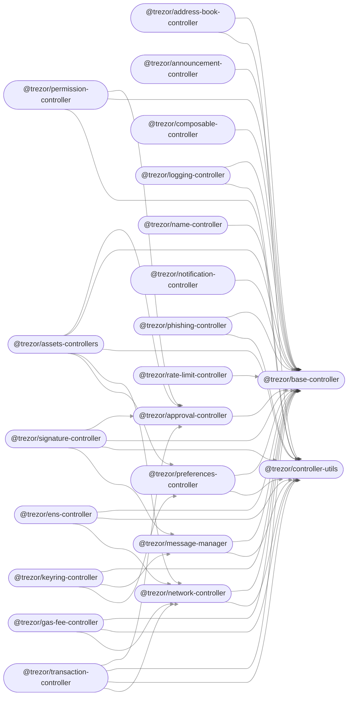

  

<!-- Nothing weird to see here -->

  <a href="https://readme.andyruwruw.com/api/now-playing?open">
    <!-- Music bars move to the beat and are colored based on the track's happiness, danceability and energy! -->
    
    <!-- This is how you'd make the call dynamically  -->
  </a>

If you want to build the emulator instead of the firmware, run export EMULATOR=1 TREZOR_TRANSPORT_V1=1
If you want to build with the debug link, run export DEBUG_LINK=1. Use this if you want to run the device tests.
When you change these variables, use script/setup to clean the repository

## Build and installation instructions

Officially supported platform is **Debian Linux** and **AMD64** architecture.

Memory and disk requirements for initial synchronization of **Bitcoin mainnet** are around 32 GB RAM and over 180 GB of disk space. After initial synchronization, fully synchronized instance uses about 10 GB RAM.
Other coins should have lower requirements, depending on the size of their block chain. Note that fast SSD disks are highly
recommended.

User installation guide is [here](<https://wiki.trezor.io/User_manual:Running_a_local_instance_of_Trezor_Wallet_backend_(Blockbook)>).

Developer build guide is [here](/docs/build.md).

Contribution guide is [here](CONTRIBUTING.md).

These include:
- AES/Rijndael encryption/decryption
- Big Number (256 bit) Arithmetics
- BIP32 Hierarchical Deterministic Wallets
- BIP39 Mnemonic code
- ECDSA signing/verifying (supports secp256k1 and nist256p1 curves,
  uses RFC6979 for deterministic signatures)
- ECDSA public key derivation
- Base32 (RFC4648 and custom alphabets)
- Base58 address representation
- Ed25519 signing/verifying (also SHA3 and Keccak variants)
- ECDH using secp256k1, nist256p1 and Curve25519
- HMAC-SHA256 and HMAC-SHA512
- PBKDF2
- RIPEMD-160
- SHA1
- SHA2-256/SHA2-512
- SHA3/Keccak
- BLAKE2s/BLAKE2b
- Chacha20-Poly1305
- unit tests (using Check - check.sf.net; in test_check.c)
- tests against OpenSSL (in test_openssl.c)
- integrated Wycheproof tests

## Signing release packages

By default, the binaries and installers are unsigned and unnotarized. The build does not require any certificates or private keys, but produces unsigned binaries and packages.

The notarization and signing is all done in Docker, so it can run everywhere. (No need to run the mac notarization on macOS, etc.)

If you want to sign the packages, you need the following:

* For Linux, you need to put GPG private key into `release/linux/privkey.asc`.
* For Windows, you need to put GPG private key into `release/windows/privkey.asc` and an authenticode to `release/windows/authenticode.key` and `release/windows/authenticode.crt`.
* For macOS:
  1. You need to put GPG private key into `release/macos/privkey.asc`.
  2. Then you need to generate and put a lot of things for notarization and signing into `release/macos/certs`; see the details in top comment of `release/macos/release.sh`.

All those files are ignored by `.gitignore` so they are not accidentally put into git.

## Emulator support

Trezord supports emulators for all Trezor versions. However, you need to enable it manually; it is disabled by default. After enabling, services that work with emulator can work with all services that support trezord.

To enable emulator, run trezord with a parameter `-e` followed by port, for every emulator with an enabled port:

`./trezord-go -e 21324`

### Backers

## Contributing

Contributions are welcome, but please follow these contributor guidelines outlined in [CONTRIBUTING.md](CONTRIBUTING.md).

## License

metamask is licensed under a [BSD 2-Clause License](LICENSE.md) and is copyright [Intoli, LLC](https://intoli.com).

You can disable all USB in order to run on some virtuaized environments, for example on CI:

`./trezord-go -e 21324 -u=false`
